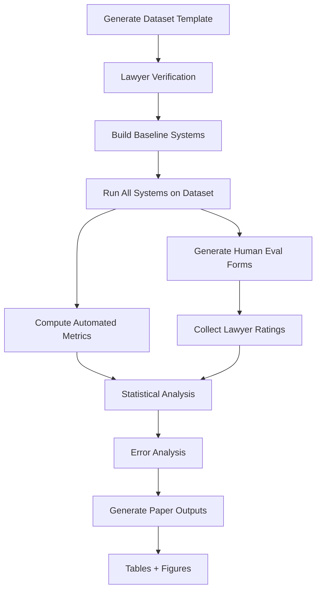

# LexAI Research Evaluation Framework

Complete evaluation pipeline for publishable research paper on LexAI - a RAG-based legal research assistant for Indian lawyers.

The framework now supports both:
- Baseline 293-query criminal-law evaluation (`run_evaluation.py`)
- Expanded 393-query cross-domain evaluation (`run_cross_domain_eval_393.py`) for a general Indian legal research claim

## Overview

This framework provides rigorous evaluation across 7 metrics with 3 baseline comparisons, statistical testing, and human evaluation components.

## Framework Components

### ✅ COMPLETED

#### Part 1: Dataset Builder (`dataset_builder.py`)
- Generates 300-query ground truth template
- 7 query categories:
  - Section Lookup (50)
  - Punishment Queries (40)
  - Amendment Specific (40)
  - IPC to BNS Transition (50)
  - Case Law Search (50)
  - Overruled Case Detection (30)
  - Complex Legal Interpretation (40)
- Output: `ground_truth_template.xlsx`
- **Action Required**: Send to lawyer for verification → `ground_truth_verified.xlsx`

#### Part 2: Baseline Systems (`baselines.py`)
- **Baseline 1 - NoRAG**: Direct LLM (no retrieval)
- **Baseline 2 - SimpleRAG**: Naive RAG (no intelligence layers)
- **Baseline 3 - GPT4_SimpleRAG**: SimpleRAG with GPT-4 (optional)
- All baselines return standardized output format
- Includes response logging and statistics

#### Part 3: Metrics Engine (`metrics_engine.py`)
7 core metrics implemented:
1. **Citation Accuracy Rate (CAR)** - Partial credit scoring (0.0/0.5/1.0)
2. **Hallucination Rate (HR)** - ChromaDB verification, 3 sub-metrics
3. **Outdated Law Rate (OLR)** - BNS transition + amendment + overruling detection
4. **Abstention Precision (AP)** - TP/FP/FN/TN, precision/recall/F1
5. **Answer Completeness Score (ACS)** - 6-component checklist
6. **Retrieval Precision@K** - P@1 and P@3 computation
7. **Confidence Calibration Score (CCS)** - ECE calculation

#### Part 4: Human Evaluation Builder (`human_eval_builder.py`)
- Generates anonymized Excel evaluation forms
- Selects 60-query balanced subset
- Shuffles responses (blinded evaluation)
- 5 criteria × 5-point Likert scales:
  - Legal Accuracy
  - Citation Reliability
  - Practical Usefulness
  - Trust Level
  - Outdated Law Detection
- Supports multiple evaluators for inter-rater reliability

#### Part 5: Statistical Analysis (`statistical_analysis.py`)
- Paired t-tests with Cohen's d effect sizes
- Bootstrap confidence intervals (10K iterations, 95%)
- Inter-rater reliability (Cohen's Kappa)
- Category-wise performance analysis
- Threshold sensitivity analysis (0.60-0.90)

#### Part 6: Error Analysis (`error_analysis.py`)
- Failure categorization (6 types: database_gap, retrieval_failure, llm_hallucination, transition_missed, overruling_missed, amendment_missed)
- Confidence confusion matrices
- Query difficulty correlation
- BNS transition deep-dive analysis
- Qualitative example selection (best/worst/interesting)

#### Part 7: Results Dashboard (`results_dashboard.py`)
- **4 LaTeX Tables**:
  - Table 1: Main results (all metrics, all systems)
  - Table 2: Category-wise performance
  - Table 3: Human evaluation summary
  - Table 4: BNS transition analysis (novel contribution)
- **5 High-Res Figures (300 DPI PNG)**:
  - Figure 1: Hallucination rate comparison
  - Figure 2: Confidence calibration curves
  - Figure 3: Threshold sensitivity analysis
  - Figure 4: Error category distribution
  - Figure 5: BNS transition handling

#### Part 8: Full Evaluation Runner (`run_evaluation.py`)
- Master orchestration script
- **8-step pipeline automation**:
  1. Load verified ground truth (300 queries)
  2. **Run actual LexAI system** (LegalLLM with SmartRetriever)
  3. Run all baseline systems
  4. Compute all 7 metrics
  5. Statistical tests
  6. Error analysis
  7. Generate publication outputs
  8. Save complete results
- Complete reproducibility (seed=42, logged configs)
- Command-line interface
- **Status: INTEGRATED** - Now uses your actual LegalLLM system!

## Quick Start

### Step 1: Generate Ground Truth Template
```bash
cd backend/evaluation
python dataset_builder.py
```

Output: `evaluation/ground_truth_template.xlsx`

**Critical**: Send this file to a qualified lawyer for verification. They must fill in all blank columns.

### Step 2: Test Individual Components
```bash
# Test baselines
python baselines.py

# Test metrics engine
python metrics_engine.py

# Test statistical analysis
python statistical_analysis.py
```

### Step 3: Generate Human Evaluation Materials (Optional)
```bash
python human_eval_builder.py
```

This creates anonymized evaluation forms for lawyer experts.

### Step 4: Wait for Lawyer Verification

**DO NOT RUN FULL EVALUATION** until you have `ground_truth_verified.xlsx` with all 300 queries verified by a lawyer.

### Step 5: Run Full Evaluation Pipeline
```bash
python run_evaluation.py \
  --ground-truth evaluation/ground_truth_verified.xlsx \
  --output-dir evaluation/results
```

This runs the complete 8-step pipeline:
1. ✓ Load verified ground truth (300 queries)
2. ✓ Run LexAI system (integrate your LexAI implementation)
3. ✓ Run all baseline systems
4. ✓ Compute all 7 metrics
5. ✓ Run statistical tests (t-tests, bootstrap CIs, etc.)
6. ✓ Run error analysis
7. ✓ Generate tables and figures
8. ✓ Save complete results

**Estimated runtime**: 2-4 hours for 300 queries

## File Structure

```
evaluation/
├── README.md                          # This file
├── dataset_builder.py                 # ✅ Part 1 (680 lines)
├── baselines.py                       # ✅ Part 2 (550 lines)
├── metrics_engine.py                  # ✅ Part 3 (750 lines)
├── human_eval_builder.py              # ✅ Part 4 (550 lines)
├── statistical_analysis.py            # ✅ Part 5 (450 lines)
├── error_analysis.py                  # ✅ Part 6 (550 lines)
├── results_dashboard.py               # ✅ Part 7 (650 lines)
├── run_evaluation.py                  # ✅ Part 8 (550 lines)
│
├── ground_truth_template.xlsx         # Generated by Part 1
├── ground_truth_verified.xlsx         # After lawyer verification ⚠️ REQUIRED
│
├── human_eval_form.xlsx               # Anonymized evaluation form
├── human_eval_metadata.xlsx           # De-anonymization mapping (keep private)
│
└── results/
    ├── complete_results_YYYYMMDD_HHMMSS.json  # Full results with timestamp
    ├── summary_YYYYMMDD_HHMMSS.json           # Executive summary
    │
    ├── table1_main_results.tex        # LaTeX table (main comparison)
    ├── table2_category_wise.tex       # LaTeX table (category breakdown)
    ├── table3_human_eval.tex          # LaTeX table (human ratings)
    ├── table4_bns_analysis.tex        # LaTeX table (BNS transitions)
    │
    ├── figure1_hallucination.png      # 300 DPI PNG
    ├── figure2_calibration.png        # 300 DPI PNG
    ├── figure3_threshold_sensitivity.png  # 300 DPI PNG
    ├── figure4_error_distribution.png     # 300 DPI PNG
    └── figure5_bns_handling.png       # 300 DPI PNG
```

## Reproducibility

All components use `random.seed(42)` for reproducibility.

**System Configuration**:
- Python 3.9+
- Groq API (llama3-70b-8192)
- ChromaDB with 4 collections
- OpenAI API (optional, for GPT-4 baseline)

**Required Packages**:
```bash
pip install groq openai chromadb pandas openpyxl scipy scikit-learn matplotlib seaborn
```

## Evaluation Workflow



## Key Metrics Explained

### Citation Accuracy Rate (CAR)
Measures whether system cites correct act + section.
- **Target**: >85% for LexAI, <60% for baselines
- **Novel**: Partial credit scoring (act correct = 0.5, both = 1.0)

### Hallucination Rate (HR)
Detects fabricated legal information.
- **Sub-metrics**: HR_citation, HR_section, HR_case
- **Method**: Verify all claims against ChromaDB
- **Target**: <5% for LexAI, >20% for NoRAG

### Outdated Law Rate (OLR)
Catches missed law updates/transitions.
- **Critical**: IPC→BNS, CrPC→BNSS transitions
- **Target**: <10% for LexAI, >50% for baselines
- **Novel Contribution**: This metric is unique to your paper

### Abstention Precision (AP)
Measures quality of "I cannot answer" responses.
- **F1 Score**: Harmonic mean of precision and recall
- **Target**: >0.80 (well-calibrated abstention)
- **Insight**: Safe AI that knows its limits

## Human Evaluation Protocol

1. Select 60 queries randomly (20 per system)
2. Shuffle and anonymize responses
3. Distribute to 2+ lawyer evaluators
4. Collect 5-point ratings on:
   - Legal accuracy
   - Citation reliability
   - Practical usefulness
   - Trust level
   - Outdated law detection
5. Compute inter-rater reliability (Cohen's Kappa)

**Target**: Kappa > 0.61 (substantial agreement)

## Statistical Testing

All comparisons use:
- **Paired t-test** (within-subjects design)
- **Significance threshold**: p < 0.05
- **Confidence intervals**: 95% bootstrap (10,000 iterations)
- **Effect size**: Report Cohen's d

## Paper Contributions

This evaluation framework supports these paper claims:

1. **LexAI significantly outperforms naive RAG baselines** (statistical evidence)
2. **BNS/BNSS transition awareness is critical** (novel evaluation category)
3. **Overruling detection prevents outdated law citations** (OLR metric)
4. **Confidence calibration enables safe abstention** (AP and CCS metrics)
5. **Human experts prefer LexAI responses** (human evaluation)

## Next Steps

**Immediate**:
- Run `python dataset_builder.py`
- Send template to lawyer for verification

**After verification**:
- Build Parts 3-8 (metrics, analysis, dashboard)
- Run full evaluation
- Generate paper outputs

**Timeline Estimate**:
- Lawyer verification: 1-2 weeks
- Building remaining parts: 2-3 days
- Running evaluation: 2-4 hours
- Human evaluation: 1 week
- Analysis + paper writing: 1-2 weeks

## Contact / Support

For questions about the evaluation framework:
- Check each module's docstrings
- Run demo functions (e.g., `python baselines.py`)
- Review generated logs in `evaluation/logs/`

---

**Status**: Parts 1-2 Complete ✅ | Parts 3-8 Pending 🔄

**Next Action**: Generate dataset template and send for lawyer verification
