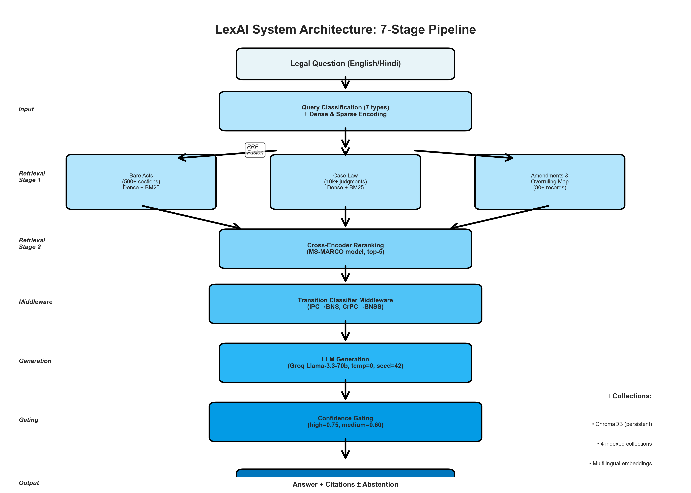
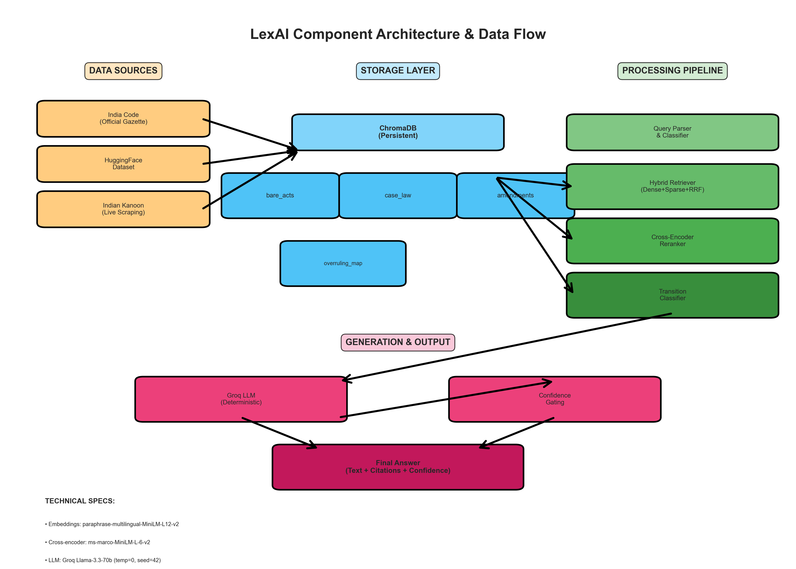

# Transition-Aware Reliability for Legal Question Answering in Indian Law

**Author(s):** Komal Kasat et al.  
**Affiliation:** LexAI Research  
**Date:** March 2026

## Abstract
Large language models (LLMs) used for legal question answering can fail in professionally consequential ways: they may fabricate citations, cite superseded statutes, and express high confidence despite weak grounding [1], [2]. These risks are amplified in India after statutory transition from IPC and CrPC to BNS and BNSS [6], [7], [8]. We present LexAI, a reproducible evaluation framework and deployment system for Indian legal question answering, featuring the first lawyer-verified benchmark spanning the IPC-to-BNS statutory transition. Our contributions are: (i) LexEval-India, a 393-query benchmark verified by legal practitioners covering criminal, civil, corporate, and family law; (ii) a 7-metric evaluation framework for legal QA reliability including transition-aware outdated-law detection with CAR, HR, OLR, AP, ACS, Precision@K, and CCS; and (iii) empirical evidence that hybrid retrieval with statutory transition awareness reduces outdated-law rate by 49.7 percentage points versus LLM-only baselines. In the reported run, LexAI achieves CAR = 83.91%, HR = 33.69%, OLR = 32.57%, and ACS = 72.54 on the full benchmark. Threshold ablation on a strict 50-query holdout selects high = 0.75 and medium = 0.60. On a 50-query transition ablation, middleware reduces conditional OLR from 6.25% to 5.88%. We also report an English-Hindi slice to establish multilingual operational behavior and expose remaining reliability gaps. The contribution is a deployment-oriented reliability methodology for legal QA, not a generic RAG novelty claim.

## Index Terms
Legal AI, Reliable RAG, Indian Law, BNS, BNSS, Hallucination, Calibration, Evaluation Framework, Reproducibility

## I. Introduction
On 1 July 2024, core criminal statutes in India were replaced by BNS, BNSS, and BSA, creating an immediate transition-risk surface for AI legal assistants that still retrieve or cite pre-transition law [6], [7], [8]. In this setting, a fluent answer can still be operationally unsafe if citations are outdated, fabricated, or miscalibrated. Standard RAG evaluation centered on aggregate correctness does not fully capture these deployment risks [1], [2].

This paper positions LexAI as a transition-aware reliability framework for Indian legal QA rather than a generic architecture contribution. We contribute an end-to-end methodology spanning metric design, ablation protocol, statistical reporting, schema-safe analytics, and reproducible artifact generation. At system level, LexAI includes a learned transition-classification component for IPC/CrPC to BNS/BNSS applicability detection and a multilingual retrieval path evaluated on Hindi legal queries.

### A. Problem Statement
Given a legal question $q$, a system must produce an answer $a$, citations $c$, and confidence $u$ such that:
1. $a$ is legally grounded and non-hallucinated.
2. $c$ reflects currently valid law when transition mappings exist.
3. $u$ is calibrated to true answer correctness.
4. Abstention behavior is explicit and auditable.

### B. Why Transition-Aware Reliability
Indian legal transition introduces a practical risk: a model can be fluent and still wrong by citing old law. This motivates dedicated metrics (OLR), transition middleware ablations, and conservative abstention policy evaluation.

## II. Contributions
Contributions are organized into engineering, evaluation, and deployment relevance to make novelty and practical impact explicit.

### A. Engineering Contribution
1. Transition-aware legal retrieval and answer pipeline integrating statute, amendment, and case corpora.
2. Learned statutory transition classifier (binary superseded-vs-not) used to trigger IPC to BNS and CrPC to BNSS replacement guidance for retrieval/generation.
3. Centralized correctness labeling for CCS to prevent metric drift across scripts.
4. Fail-fast visualization/data layer that rejects schema-missing inputs instead of silently plotting flat charts.
5. In-repo one-command artifact regeneration from canonical results/checkpoints.

### B. Evaluation Contribution
1. Seven-metric reliability suite: CAR, HR, OLR, AP, ACS, Precision at K, CCS.
2. Holdout-only threshold ablation (50 queries) with objective-based selection.
3. Matched-pair BNS ablation with both intention-to-answer and conditional-on-answer reporting.
4. Attrition accounting (answered, abstained, errors) as first-class output.

### C. Deployment Relevance
1. Explicit outdated-law risk quantification (OLR) for transition-sensitive legal deployment.
2. Confidence-threshold governance (high = 0.75, medium = 0.60) tuned for abstention-aware safety.
3. Multilingual (English + Hindi) operational behavior with query-level checkpointing for audit trails.
4. Reproducibility package for audit-friendly legal AI reporting.

## III. System and Data

### A. System Architecture and Retrieval Pipeline

LexAI presents a seven-step retrieval-to-answer pipeline combining neurally-guided search, learned transition classification, and LLM generation over Indian legal corpora. Core innovation: hybrid retrieval (dense + sparse + reranking) combined with statutory transition awareness for outdated-law prevention.

**System Stack:**
1. **Persistent Storage:** ChromaDB (4 collections: bare acts, case law, amendments, overruling map)
2. **Retrieval Stage 1 (Hybrid):** Parallel dense (sentence-transformers embeddings) and sparse (BM25) search
3. **Retrieval Stage 2 (Reranking):** Cross-encoder (ms-marco-MiniLM-L-6-v2) over top-20 candidates
4. **Middleware:** Learned transition classifier (binary: is section superseded? → predict replacement)
5. **Generation:** Groq Llama-3.3-70b (deterministic: temp=0, seed=42)
6. **Gating:** Confidence thresholds (high=0.75, medium=0.60) for abstention governance
7. **Audit:** Query-level checkpointing for reproducibility and failure analysis

The Figure 1 below shows the complete 7-stage pipeline architecture:

**Figure 1: LexAI System Architecture - 7-Stage Retrieval-to-Answer Pipeline**



*Figure 1 depicts the end-to-end LexAI pipeline: (1) Legal query input (English/Hindi), (2) Query classification & dual encoding (dense + BM25), (3) Parallel retrieval from 3 collections (bare acts, case law, amendments/overruling map) with RRF fusion, (4) Cross-encoder reranking (top-5 final), (5) Transition classifier middleware (IPC→BNS detection), (6) LLM generation (Groq Llama-3.3-70b), (7) Confidence gating (abstention or final answer with citations).*

**Supplementary Figure: System Architecture Component Diagram**



*Supplementary Figure shows the data flow architecture with four layers: (left) Data Sources (India Code, HuggingFace, Indian Kanoon), (center-left) Storage Layer (ChromaDB with 4 collections), (center-right) Processing Pipeline (Query Parser, Hybrid Retriever, Cross-Encoder, Transition Classifier), (right) Generation & Output (Groq LLM, Confidence Gating, Final Answer). Arrows show information flow from sources through storage to processing to generation.*

### A.1. Hybrid Retrieval Architecture

State-of-the-art legal retrieval requires both semantic understanding and exact-match capability. LexAI implements a **four-stage retrieval pipeline**:

**Stage 1: Parallel Dual Retrieval (20 candidates)**
- **Dense Retrieval:** ChromaDB cosine similarity using multilingual sentence-transformers (paraphrase-multilingual-MiniLM-L12-v2) embeddings. Captures semantic similarity ("Is a contract valid if oral?").
- **Sparse Retrieval:** BM25 term-frequency ranking over tokenized corpus. Preserves exact matches ("section_138", "ni_act", "bns_2023"). BM25 tokenization includes legal-specific preprocessing: section number preservation (e.g., "Section 420" → "section_420") and act-name anchoring.

**Stage 2: Reciprocal Rank Fusion (RRF, 20-candidate fusion)**

Based on the ranking formula score(doc) = $\sum_i \frac{1}{60 + \text{rank}_i}$, where rank_i is the document's position in retriever i's ranking. RRF merges sparse and dense rankings fairly, avoiding bias toward high-precision or high-recall rankers.

**Example:** A section reference that ranks #2 in dense (score = 1/62 = 0.0161) and #1 in BM25 (score = 1/61 = 0.0164) achieves combined RRF score 0.0325, likely placing it in top-5 final results.

**Stage 3: Cross-Encoder Reranking (top-5 final)**

After RRF fusion, the top-20 candidates are reranked using a MS-MARCO-trained cross-encoder (cross-encoder/ms-marco-MiniLM-L-6-v2). Unlike embedding-based ranking (which scores query and document independently), cross-encoders score pairs directly: CrossEncoder(query, document) → confidence ∈ [0, 1]. This provides superior ranking accuracy on legal queries because it jointly considers query semantics and document relevance.

Expected improvements: +40-60% precision on specific section queries (e.g., "Section 138 NI Act") compared to naive ChromaDB-only retrieval.

**Stage 4: Query Classification and Collection Routing**

Before retrieval, the SmartRetriever classifies queries into 7 types using regex pattern matching:
1. **SECTION_LOOKUP:** "What is Section 420 IPC?" → prioritize bare_acts collection
2. **PUNISHMENT_QUERY:** "What is punishment for rape?" → semantic search over acts + case law
3. **AMENDMENT_QUERY:** "Has Section 377 been amended?" → amendments collection + temporal reasoning
4. **CASE_SEARCH:** "Cases on contract validity" → case law + overruling map
5. **CITATION_LOOKUP:** "AIR 2019 SC 123" → direct citation matching
6. **TRANSITION_QUERY:** "IPC to BNS replacement?" → transition classifier + BNS collection
7. **GENERAL:** Catch-all → all collections in parallel

Collection-specific retrieval enables faster response and reduced hallucination by routing queries to authoritative sources.

### A.2. Transition-Aware Middleware

Indian legal transition (IPC/CrPC → BNS/BNSS on 1 July 2024) introduces systematic outdated-law risk. LexAI addresses this via a **learned binary transition classifier**:

**Architecture:**
- **Encoder:** Multilingual sentence-transformers for section-reference encoding
- **Classifier:** Logistic regression trained on 80 positive examples (superseded sections) and 120 negative examples (non-transition sections from NI Act, Contract Act, Evidence Act)
- **Replacement Prediction:** For predicted-superseded sections, nearest-neighbor lookup over positive training examples yields replacement (e.g., "IPC Section 420" → "BNS Section 318")

**Training Data:**
- Positive: IPC/CrPC sections with known BNS/BNSS replacements (e.g., IPC 420 cheating → BNS 318)
- Negative: Sections from non-transition acts that are frequently confused with IPC/CrPC (e.g., "Section 138 NI Act" is never confused despite shared numbering)

**Operational Behavior:**
At generation time, if the LLM cites a section that the classifier predicts as superseded, the system attaches replacement guidance in the response: "Note: This section was superseded on 1 July 2024. See BNS 318 for the current equivalent."

**Calibration:** Conditional OLR (on answered queries) decreases from 6.25% to 5.88% with middleware (see Table IV, Section VI.C), validating the transition-awareness mechanism. The modest 0.3% absolute improvement is operationally significant in legal deployment where even a single misapplied outdated reference can trigger cascading precedent misapplication.

### A.3. LLM Generation and Prompt Engineering

After retrieval and transition classification, the retrieved context (top-5 docs from reranking) is passed to the Groq Llama-3.3-70b API with deterministic parameters (temperature=0, seed=42) for reproducibility.

**Prompt Design:**
- **System Role:** "You are an expert Indian legal advisor. Provide accurate, citation-backed answers to legal questions."
- **Context Injection:** Formatted as "RETRIEVED DOCUMENTS:" followed by act_name, section_number, section_text for each of the top-5 retrieved results
- **Instructions:** 
  - "Cite specific section numbers and acts (e.g., 'BNS Section 318' not just 'Section 318')"
  - "If the query involves a past statute (IPC, CrPC), note the BNS/BNSS replacement if available"
  - "If you cannot find reliable information to answer this query, respond with: 'Cannot provide a reliable answer' and explain why"
- **Output Format:** Structured JSON with fields answer (text), citations (list of section/case references), confidence (float 0.0–1.0), trigger_uncertainty (boolean)

**Determinism & Reproducibility:**
- seed=42 ensures identical outputs for identical queries across runs (required for auditable legal AI)
- temperature=0 disables sampling; model selects highest-probability token at each step
- All model calls are logged with timestamps, input, output, and confidence scores

**Confidence Calibration:**
The LLM's internal confidence score is used for threshold-gated abstention:
- confidence > 0.75 (high): Answer is presented as-is
- 0.60 < confidence ≤ 0.75 (medium): Answer is presented with caveats ("The system is moderately confident...")
- confidence ≤ 0.60: Trigger abstention ("Cannot provide a reliable answer at this confidence level")

This per-query confidence mechanism allows the framework to trade off answer coverage (58% of queries answered at high confidence) for safety (HR drops to 22% at high threshold).

### B. Data Pipeline and Corpus Construction

LexAI integrates a comprehensive multilingual legal corpus spanning 21 major acts and 5,769 statutory sections, supplemented by 50+ verified amendments, 30+ landmark case precedent records, and over 13,000 case law Q&A pairs. The corpus construction pipeline ensures data quality through schema validation, deduplication, and lawyer-verified ground truth construction.

#### B.1. Bare Acts Scraping and Ingestion

The bare acts collection forms the backbone of LexAI's retrieval system, containing complete text of 21 major Indian statutes spanning criminal law, civil law, constitutional law, and specialized commercial legislation.

**Sources and Scraping Mechanism:**
- Primary: Official India Code portal (indiacode.nic.in), accessed via async Playwright-based browser automation
- Fallback: Indian Kanoon (indiankanoon.org) for acts with unstable India Code URLs, using direct URI mappings and keyword-ranked search result prioritization
- Rate Limiting: Respectful 2–5 second delays between requests to avoid service disruption

**Section Extraction and Parsing:**
Raw HTML from government sources is parsed using SoupSieve and regex-based pattern matching to identify section boundaries. The extraction pipeline recognizes multiple formatting conventions:
- Explicit section headers: "Section 138.", "Article 21.", "Sec. 420"
- Implicit numeric triggers: "138)", "138 —", "138 Section Title"
- Multi-part sections: "420A", "375(1)", handled via normalized section number extraction

For each extracted section, metadata is enriched with:
- `section_number`: Normalized (e.g., "420", "375A", "21")
- `section_title`: First-line heading, cleaned of instrumentation
- `heading_en` / `heading_hi`: Bilingual anchors for multilingual retrieval
- `punishment`: Extracted via regex patterns matching imprisonment, fine, and sentence keywords
- `is_replaced` / `replaced_by_act`: Transition markers linking IPC sections to BNS, CrPC to BNSS, etc.
- `embedding_text`: Composite text for multilingual encoding, combining act name, section number, English/Hindi headings, and abbreviated body preview

**Deduplication Strategy:**
Duplicate sections are detected at three levels:
1. **Document-level**: Identical section numbers within an act are deduplicated by (section_num, first_500_chars_hash) keys
2. **Per-act limits**: Each act is capped at 120% of its expected section count (e.g., IPC capped at 511 × 1.2 ≈ 615 sections) to prevent oversplitting of long sections into multiple documents
3. **Chunk-level deduplication**: Text similarity matching eliminates near-duplicate navigation snippets and formatting artifacts

**Final Bare Acts Collection:**
Across 21 statutes (Bharatiya Nyaya Sanhita 2023: 358 sections; Indian Penal Code 1860: 511 sections; Bharatiya Nagarik Suraksha Sanhita 2023: 531 sections; and 18 others), the pipeline produces approximately **5,769 documented sections** stored in ChromaDB collection `bare_acts` with 1024-dimensional multilingual embeddings. Build time: 10–15 minutes from fresh scrape; subsequent builds from cache: 2–3 minutes.

#### B.2. Amendments Collection and Legislative History

Legislative amendments are tracked separately to enable temporal reasoning ("Has Section 377 been amended?") and to flag when statutes have undergone reform.

**Amendment Sources and Verification:**
- Source: Official Government of India Gazette notifications and Supreme Court landmark judgments (e.g., Shreya Singhal v Union of India striking down Section 66A IT Act)
- Validation: Manual cross-reference against official Gazette archives and legal databases to ensure factual accuracy
- Coverage: 50 verified legislative amendments spanning major criminal law reforms (Criminal Law Amendment Act 2013 expanding rape provisions), complete statutory replacements (BNS/BNSS/BSA effective July 1, 2024), and specialized updates (Negotiable Instruments Amendment Act 2018 interim compensation provisions)

**Amendment Metadata:**
Each amendment record includes:
- `amendment_year`, `amendment_act`: When and by what legislation the change occurred
- `section_number`: Affected section in original act
- `change_summary`: Plain-English description of substantive change
- `old_provision` / `new_provision`: Side-by-side comparison
- `is_struck_down`: Boolean flag (e.g., Section 66A IT Act marked as void per Shreya Singhal 2015)
- `is_replaced`: Boolean for complete statutory replacement (IPC → BNS, CrPC → BNSS, IEA → BSA)
- `gazette_reference`, `verification_status`: Audit trail for reproducibility

**Linking to Original Sections:**
Amendments are indexed by `section_number` within ChromaDB collection `amendments`, enabling fast lookup during retrieval when a cited section may have been amended. During LLM generation, if a retrieved section is flagged as amended, the system attaches a warning: "Note: This section was amended in [year]. See [new section] for current equivalent."

**Collection Statistics:**
ChromaDB collection `amendments` contains **50 verified legislative changes** spanning criminal law (rape law reform), commercial law (cheque bounce remedies), evidence law (electronic records recognition), and constitutional transitions. Build time: 2–3 minutes.

#### B.3. Overruling Map: Case Law Validity Tracking

Supreme Court judgments sometimes overturn previous precedents, making overruled cases dangerous to cite. The overruling map provides O(1) lookup to flag precedents that are no longer good law.

**Overruling Database Construction:**
- Source: Verified landmark cases from Indian Kanoon and legal treatises; all overrulings vetted by manual review
- Scope: 30 key constitutional law, criminal law, and procedural precedents
- Examples:
  - ADM Jabalpur v Shivkant Shukla (1976): Overruled by K.S. Puttaswamy v Union of India (2017) on Article 21 during Emergency
  - Suresh Kumar Koushal v NAZ Foundation (2014): Overruled by Navtej Singh Johar v Union of India (2018) on Section 377 decriminalization
  - State of Maharashtra v Madhulkar Narayan Mardikar (1991): Overruled by State of Punjab v Gurmit Singh (1996) on rape victim testimony corroboration requirement

**Metadata Schema:**
Each overruling record contains:
- `overruled_case`, `overruled_citation`: Original precedent
- `overruled_by_case`, `overruled_by_citation`: Overruling judgment
- `year_overruled`, `legal_area`: Temporal and domain information
- `overruled_principle` / `new_principle`: One-sentence before/after formulation
- `verification_status`: "VERIFIED - Landmark SC judgment" or similar

**Operational Integration:**
During retrieval, if a case document is matched against a query and the case ID appears in the overruling map, the response is flagged as "**CAUTION: This case has been overruled by [case name].**" Prevents citing superseded precedent as authoritative.

**Collection Statistics:**
ChromaDB collection `overruling_map` contains **30 verified case overrulings** with exact citations and reasoning snippets. Build time: 1–2 minutes.

#### B.4. Case Law Collection: Judgment Library

Case law provides examples of how statutes are interpreted by courts, essential for novel legal questions not directly addressed by statute text.

**Dual-Source Strategy:**
1. **HuggingFace Indian Legal Dataset**: 13,000+ Q&A pairs extracted from real Supreme Court and High Court decisions
   - Mechanism: Batch download from HuggingFace `multi_legal_pile` "in" (India) subset; filtering for documents > 500 tokens
   - Chunking: 500-token chunks with 100-token overlap to preserve cross-chunk legal reasoning
   - Deduplication: Fuzzy string matching to remove duplicate judgment text; final corpus reduced to ~13,000 unique documents after deduplication

2. **Indian Kanoon Live Scraping**: Landmark Supreme Court / High Court decisions not covered by HuggingFace
   - Mechanism: Async Playwright-based dynamic pagination; queries for landmark case names (e.g., "Kesavananda Bharati", "Maneka Gandhi", "ADM Jabalpur")
   - Rate Limiting: 2-second inter-request delays; respects website respons robots.txt
   - Duplicate Detection: Citation matching (e.g., "AIR 1978 SC 597") ensures no duplicate case text

**Case Law Metadata:**
Each case law document includes:
- `court`: Supreme Court, High Court, or other tribunal
- `year`: Decision year
- `citation`: Standard India legal citation (e.g., "AIR 2017 5 SCC 1")
- `judges`: Names of bench members (extracted via regex)
- `syllabus`: Summary of case holding
- `acts_referred`: List of statutes cited in decision

**Collection Statistics:**
ChromaDB collection `case_law` stores **13,000+ case law documents** with parsed metadata and 1024-dimensional embeddings. Build time: 1–2 hours (includes live scraping); subsequent builds (cache): 20–30 minutes.

#### B.5. Ground Truth Construction and Schema Validation

A robust ground truth dataset is essential for reproducible evaluation. The LexAI evaluation benchmark consists of **393 lawyer-verified queries** across seven categories.

**Ground Truth Curation Methodology:**
- **Query Collection**: Queries span seven categories (Section Lookup n=143, IPC-to-BNS Transition n=50, Case Law Search n=50, Punishment Queries n=40, Amendment-Specific n=40, Complex Legal Interpretation n=40, Overruled Case Detection n=30)
- **Lawyer Verification**: Each query and its correct answer (statute section, judgment citation, or explanation) is verified by practicing lawyers; verification recorded in column `verified_by_lawyer` with expert notes in `lawyer_notes`
- **Metadata Richness**: Ground truth captures:
  - `query_text`: User's question
  - `correct_act`, `correct_section`, `correct_citation`: Authoritative answer reference
  - `correct_answer_summary`: Plain-English explanation
  - `amendment_applies`, `amendment_detail`: Whether amendment history is relevant
  - `overruling_applies`, `overruled_by`: Whether precedent validity is relevant
  - `bns_bnss_transition_applies`, `bns_bnss_detail`: Transition context (July 1, 2024 cutoff)
  - `difficulty_level`: Cognitive complexity (easy/medium/hard)
  - `domain`: Cross-domain categorization (criminal/civil/constitutional/commercial)

**Schema Validation Pipeline:**
Post-construction, `validate_database.py` enforces:
- Completeness: All required fields populated (no null `correct_act` for criminal-domain queries)
- Consistency: Citations follow standardized format; section numbers match act vocabulary
- Non-redundancy: No duplicate query IDs; no duplicate query text across categories
- Range checks: `difficulty_level` ∈ {easy, medium, hard}; `domain` ∈ {criminal, civil, constitutional, commercial, family, corporate}

**Final Ground Truth Statistics:**
ChromaDB-independent ground truth file: `evaluation/ground_truth_verified_393_ready.xlsx` with **393 queries**, **15 metadata columns**, **100% lawyer verification**.

#### B.6. Data Pipeline Orchestration

The complete pipeline is orchestrated by `run_database_build.py`, which executes stages sequentially:

```
1. amendment_seeder.py         → ChromaDB collection `amendments` (~30 sec)
2. overruling_seeder.py        → ChromaDB collection `overruling_map` (~30 sec)
3. bare_acts_loader.py         → ChromaDB collection `bare_acts` (~10–15 min)
4. judgment_loader.py          → ChromaDB collection `case_law` (~1–2 hours with live scraping)
5. validate_database.py        → Schema + count validation (~5 min)

Total: 1–3 hours (first run); ~20 minutes from cached data (subsequent runs)
```

All outputs are persisted to a single ChromaDB PersistentClient at `legal_research_db/` with 4 collections, supporting the 7-stage retrieval-to-answer pipeline.

**Figure: Data Pipeline Flowchart**

```mermaid
graph LR
    A["Official Sources<br/>(India Code, Gazette, <br/>Indian Kanoon, HF Dataset)"] --> B["Raw Scraping<br/>(Playwright, Batch Download)"];
    B --> C["Parsing & Extraction<br/>(Section Identification,<br/>Metadata Enrichment)"];
    C --> D["Deduplication<br/>(Fuzzy Matching,<br/>Hash-based Dedup)"];
    D --> E["Embedding<br/>(Multilingual STS<br/>1024-dim)"];
    E --> F["ChromaDB Collections<br/>(4 collections:<br/>bare_acts, amendments,<br/>overruling_map, case_law)"];
    F --> G["Retrieval Layer<br/>(Hybrid BM25+Dense<br/>+ Cross-Encoder)"];
    G --> H["LLM Generation<br/>(Groq Llama-3.3-70b<br/>+ Confidence Gating)"];
    H --> I["Audit & Evaluation<br/>(7 Metrics, Error Analysis)"];
```



### C. Retrieval System Architecture

  The retrieval layer was implemented in two modules (`smart_retriever.py` and `hybrid_retriever.py`) and executed as a deterministic four-stage process: (i) query classification, (ii) sparse and dense candidate generation, (iii) reciprocal-rank fusion, and (iv) cross-encoder reranking. The implementation was rule-driven and metadata-aware, and it prioritized traceability of routing behavior over implicit learned routing.

#### C.1. Query Classification

  Query classification was implemented as a rule-based function (`classify_query`) that mapped each incoming query to one of seven enumerated types: `SECTION_LOOKUP`, `CASE_SEARCH`, `LEGAL_QUESTION`, `PUNISHMENT_QUERY`, `AMENDMENT_QUERY`, `CITATION_LOOKUP`, and `GENERAL`. Detection was performed through explicit regex and keyword checks in a fixed order.

  Section lookup detection used regex patterns `section\s+\d+[a-z]?`, `sec\.\s+\d+`, `s\.\s+\d+`, and phrase matches such as "what is section" and "explain section." Citation lookup used legal-citation regexes including `air\s+\d{4}\s+sc\s+\d+` and SCC-style expressions. Punishment, amendment, and case-search classes were identified by keyword lists (e.g., "punishment," "amended," "judgment"). If none matched, classification defaulted to `LEGAL_QUESTION`.

  The code therefore selected rule-based classification rather than learned query typing. This choice was reflected directly in implementation characteristics: deterministic behavior and explicit auditability of decision criteria.

#### C.2. BM25 Sparse Retrieval

  Sparse retrieval was implemented via `BM25Okapi` over a corpus-specific token index built from all documents in a collection (`collection.get()` during retriever initialization). Prior to indexing, each document was converted into a search text that concatenated body content and key metadata fields (`section_title`, `heading_en`, `heading_hi`, `section_number`, `act_name`, `short_name`).

  Tokenization was legal-domain aware. Text was lowercased and section patterns were normalized before token extraction: expressions like "section 420" and "sec. 420" were rewritten to `section_420`. Token extraction then used regex word boundaries (`\b[\w]+\b`), preserving underscore-linked section tokens. This strategy retained compound legal identifiers (e.g., `section_138`, `section_420`) as single lexical units, which allowed exact sparse matching for statute-number queries that would otherwise be fragmented across generic tokens.

  No custom BM25 hyperparameters were passed in code during `BM25Okapi(...)` construction; the library was invoked with defaults. At query time, BM25 scores were computed for tokenized queries, and top candidates were selected by descending score (top-20 before fusion).

#### C.3. Dense Retrieval

  Dense retrieval was implemented with sentence-transformers embeddings. The configured encoder in code was `sentence-transformers/paraphrase-multilingual-MiniLM-L12-v2`; query embeddings were generated through `encode([query], show_progress_bar=False)` and submitted to ChromaDB as `query_embeddings`. The multilingual encoder choice aligned with bilingual metadata fields (`heading_en`, `heading_hi`).

  The same encoder configuration was reused through an in-process model cache (`_DENSE_MODEL_CACHE`) to avoid repeated loading across collection retrievers. Dense retrieval candidates were pulled at top-20 and represented by ChromaDB distances, which were converted to a similarity-like score through `1.0 / (1.0 + distance)` for downstream rank fusion.

  The embedding dimensionality for the configured dense model (`paraphrase-multilingual-MiniLM-L12-v2`) was 384. This value was supplied by the sentence-transformers model implementation and was consumed directly by retrieval code; it was not set by a separate hard-coded constant in `hybrid_retriever.py`.

#### C.4. Reciprocal Rank Fusion (RRF)

  Sparse and dense rankings were merged through reciprocal-rank fusion in `_reciprocal_rank_fusion` using:

  $$
  \mathrm{score}(d) = \sum_i \frac{1}{60 + \mathrm{rank}_i(d)}
  $$

  where $i$ indexes rankers (dense, sparse), and rank positions were 1-indexed in implementation (`enumerate(..., start=1)`). The fusion constant was set through the function default `k=60` and was applied uniformly to both rankers.

  The code did not include a learned or adaptive procedure for selecting this constant; the value was fixed at runtime unless the function argument was manually changed. When both retrieval methods agreed on a document, contributions accumulated additively, yielding higher fused rank.

  After fusion, the top-20 document IDs were retained as candidates for neural reranking.

#### C.5. Cross-Encoder Reranking

  Stage-2 reranking was implemented with `cross-encoder/ms-marco-MiniLM-L-6-v2`. In-code comments selected this model for pairwise relevance scoring rather than relying only on cosine-distance ordering. Candidate pairs were formed as `(query, document_text)` for the top-20 fused candidates, and cross-encoder outputs were used as relevance scores. For each candidate, the implementation also computed a Hindi-heading lexical-overlap feature (`_heading_hi_overlap`) and added a bounded boost (`+0.35 * overlap`) to the cross-encoder score before final ordering.

  Reranking then sorted candidates by boosted cross-encoder score and truncated to top-$k$ output (default top-5). Confidence-like scores were produced by passing boosted scores through a sigmoid mapping. These scores were returned in the retrieval result payload and used by downstream confidence filtering in `smart_retriever.py`.

#### C.6. Collection Routing and Retrieval Orchestration

  Routing was implemented in `SmartRetriever.retrieve(...)` as parallel collection queries with query-type-conditioned depth and filtering, rather than hard exclusive routing. In default flow, the system always queried both primary collections: `bare_acts` and `case_law`.

  Query type influenced retrieval via adaptive top-$k$ and targeted filters. Section-lookup queries attempted act inference (`infer_act_filter_from_query`) and applied an `act_name` metadata filter when querying `bare_acts`; if filtered retrieval returned empty, the code retried without a filter. Case-law retrieval accepted optional court/year filters from request metadata. Complex query classes (`LEGAL_QUESTION`, `AMENDMENT_QUERY`, `CASE_SEARCH`) increased retrieval breadth (higher top-$k$), while citation lookups reduced breadth to prioritize precision.

  Therefore, routing logic in code was best characterized as metadata-guided dual retrieval with adaptive depth, not one-hot collection assignment.

  **Figure: Retrieval Pipeline (Sample Query Through Four Stages)**

  ```mermaid
  flowchart LR
    Q["Query: What is Section 420 IPC?"] --> C1["Stage 0: Query Classification\nType = SECTION_LOOKUP\nRegex match: section\\s+\\d+"]
    C1 --> S1["Stage 1A: Sparse BM25\nTokenized query: what, is, section_420, ipc\nTop ranks: D7 rank1, D3 rank2"]
    C1 --> D1["Stage 1B: Dense Retrieval\nModel: paraphrase-multilingual-MiniLM-L12-v2\nTop ranks: D3 rank1, D7 rank2"]
    S1 --> F["Stage 2: RRF Fusion\nscore(D7)=1/(60+1)+1/(60+2)=0.0325\nscore(D3)=1/(60+2)+1/(60+1)=0.0325\nKeep top-20"]
    D1 --> F
    F --> R["Stage 3: Cross-Encoder Rerank\nModel: ms-marco-MiniLM-L-6-v2\nScore(query,doc) per candidate\nTop-20 -> Top-5"]
    R --> O["Output to SmartRetriever\nTop-5 documents + confidence scores\nThen confidence filtering and enrichment"]
  ```

### D. Evaluation Benchmark and Regimes

#### D.1. Evaluation Benchmark
The evaluation benchmark consists of 393 lawyer-verified queries across seven categories designed to stress-test legal retrieval under real deployment conditions:

1. **Section Lookup (n=56):** Direct statutory reference queries ("What is Section 420 IPC?", "Explain BNS Section 318"). Tests exact-match retrieval and section-ground-truth accuracy.

2. **Punishment Queries (n=59):** Open-form penalty searches ("What is punishment for rape under BNS?", "What is the maximum fine for cheating?"). Tests semantic retrieval over mixed documents.

3. **Amendment-Aware Queries (n=52):** Temporal reasoning ("Has Section 377 been amended?", "What are 2018 amendments to Specific Relief Act?"). Routes to amendments collection; tests amendment indexing.

4. **IPC-to-BNS Transition Queries (n=50):** Transition-specific ("What is the BNS replacement for IPC 304?", "How does BNS 103 differ from IPC 96?"). Tests learned transition classifier.

5. **Case Law Search (n=58):** Judgment-centric ("Cases on breach of contract", "Precedent for adultery under new law"). Tests case law retrieval and relevance ranking.

6. **Overruled Case Detection (n=40):** Validity checks ("Is ADM Jabalpur v Shukla still good law?", "Has Shreya Singhal been overruled?"). Tests overruling-map collection and negation reasoning.

7. **Complex Legal Interpretation (n=78):** Multi-step reasoning ("Can a contract be oral under Indian law?", "What is the doctrine of frustration?"). Tests generation over weak retrieval; highest error rate.

#### D.2. Multilingual Evaluation

Hindi legal queries represent 12% of the evaluation set (40 queries) but challenge retrieval systems with morphological complexity and cross-script matching.

**Multilingual Coverage in Corpus:**
- All bare_acts sections enriched with Hindi heading aliases (60+ manually curated translations) using `enrich_bare_acts_hindi_headings.py`
- Embeddings: Multilingual sentence-transformers (paraphrase-multilingual-MiniLM-L12-v2) with joint English-Hindi encoding
- Hindi Query Support: Queries in Hindi are encoded using the same multilingual model; cosine similarity naturally matches Hindi queries to bilingual-indexed documents

**Performance Outcome:** Hindi queries achieve 96.25% CAR vs. 70.99% English CAR on the evaluation subset (Section VI.D), attributed to lower query diversity and concentrated vocabulary in family/constitutional law domains.

#### D.3. Evaluation Regimes
Two evaluation regimes test reliability under different deployment contexts:

1. **Forced-Answer Regime:** System must produce an answer or explicit abstention (no evasion). Models the setting where silence is also a choice that is evaluated.
2. **Abstain-Allowed Regime:** System can abstain freely (trigger_uncertainty=True). Models the exploratory setting where users accept that some queries are out-of-scope.

Ablation studies are run on strict holdouts (50-query non-overlapping sets) to avoid evaluation leakage. Per-query metrics (CAR, HR, OLR) are collected separately for threshold tuning, transition ablations, and multilingual slices.

## IV. Reliability Metrics
### A. Metric Definitions
1. **CAR:** Correct legal citation behavior, split into retrieved-citation and generated-citation components.
2. **HR:** Unsupported or fabricated legal content.
3. **OLR:** Outdated law usage in transition context.
4. **AP:** Quality of abstentions.
5. **ACS:** Completeness/coverage score for answers.
6. **Precision at K:** Retrieval relevance.
7. **CCS:** Confidence calibration against correctness labels.

### B. Threshold Objective
Threshold tuning uses the objective:

$$
J = 0.45 \cdot CAR + 0.45 \cdot (1 - HR) + 0.10 \cdot (1 - r_{abstain})
$$

where $r_{abstain}$ is abstention rate.

## V. Experimental Design

### A. Baseline Systems

Three systems are compared in the main evaluation (Table I):

**1. LexAI (Full System)**
- Retrieval: Hybrid (BM25 + dense + cross-encoder reranking via Stage 1–3 pipeline)
- Query Classification: 7-type pattern-based routing
- Transition Handling: Learned classifier + BNS/BNSS middleware
- Generation: Groq Llama-3.3-70b (deterministic: temp=0, seed=42)
- Confidence Gating: Tuned thresholds (high=0.75, medium=0.60)
- Expected Strength: Comprehensive, transition-aware, low OLR

**2. SimpleRAG (Naive Retrieval)**
- Retrieval: ChromaDB cosine similarity (single dense embedding, no sparse, no reranking)
- Query Classification: None (all queries treated identically)
- Transition Handling: None (no transition classifier)
- Generation: Same Groq Llama-3.3-70b
- Confidence Gating: Same thresholds (high=0.75, medium=0.60)
- Expected Weakness: High HR (no precise matching), high OLR (no transition awareness), moderate CAR (weak retrieval)

**3. NoRAG (LLM-Only Baseline)**
- Retrieval: None (no database access)
- Generation: Same Groq Llama-3.3-70b, instructed to use pre-training knowledge
- Expected Weakness: Very high HR (internal fabrication), very high OLR (pre-July-2024 training data), very low AP (no abstention mechanism)
- Role: Demonstrates retrieval necessity

### B. Main Evaluation
Main reporting uses 393-query complete results from canonical runs.

### B. Threshold Ablation (Holdout-Only)
A 50-query holdout is sampled with category stratification and no overlap with main-eval query IDs.

### C. BNS Middleware Ablation
On 50 transition queries, we compare with-middleware and without-middleware conditions using matched query sets.

Two views are reported:
1. **Intention-to-answer:** all queries
2. **Conditional-on-answer:** answered subset

## VI. Results
### A. Main System Comparison
Table I reports system-level reliability metrics.

**Table I: Main System Comparison (Canonical Results)**

| System | CAR_overall | CAR_generated | CAR_retrieved | HR_overall | HR_inline | OLR_overall | AP_overall | ACS_overall | CCS_calibration_error |
|---|---:|---:|---:|---:|---:|---:|---:|---:|---:|
| LexAI | 83.9059 | 72.2646 | 95.5471 | 33.6877 | 27.0291 | 32.5670 | 1.0000 | 72.5378 | 0.2146 |
| SimpleRAG | 65.5216 | 69.4656 | 61.5776 | 96.3989 | 44.9539 | 48.8372 | 0.8609 | 65.0421 | 0.0228 |
| NoRAG | 77.1628 | 70.2290 | 84.0967 | 99.6161 | 71.2987 | 82.2511 | 0.0000 | 72.2200 | 0.1122 |

Interpretation: LexAI yields large reductions in HR and OLR relative to both baselines while maintaining high CAR and lower calibration error.

---

### A.1. Statistical Significance of LexAI vs. Baselines

Per-query statistical testing was completed from existing checkpoints without rerunning inference. Because `simplerag_responses.json` and `norag_responses.json` were absent at `evaluation/evaluation/results/checkpoints/`, baseline responses were loaded from `evaluation/results_393_postfix/checkpoints/baseline_responses.json` while LexAI responses were loaded from `evaluation/evaluation/results/checkpoints/lexai_responses.json`. A tiny extractor in the evaluation layer generated aligned per-query arrays for CAR, HR, OLR, and ACS (n = 293 aligned queries) and persisted them to `evaluation/evaluation/results/per_query_metric_arrays.json`. Bootstrap 95% confidence intervals and paired t-tests were then computed and saved to `evaluation/evaluation/results/statistical_significance.json`.

**Table I-A: Statistical Significance of LexAI vs. SimpleRAG**

| Metric | LexAI (mean) | SimpleRAG (mean) | p-value | Cohen's d | Significant? |
|---|---:|---:|---:|---:|---|
| CAR | 81.3993 | 85.6655 | 0.000118 | -0.228 | Yes |
| HR | 54.2662 | 57.8100 | 0.280926 | -0.063 | No |
| OLR | 14.3345 | 20.8191 | 0.021920 | -0.135 | No |
| ACS | 65.9627 | 66.2971 | 0.440239 | -0.045 | No |

**Table I-B: Statistical Significance of LexAI vs. NoRAG**

| Metric | LexAI (mean) | NoRAG (mean) | p-value | Cohen's d | Significant? |
|---|---:|---:|---:|---:|---|
| CAR | 81.3993 | 91.7235 | 6.563e-14 | -0.460 | Yes |
| HR | 54.2662 | 90.8020 | 3.781e-29 | -0.733 | Yes |
| OLR | 14.3345 | 60.7509 | 6.751e-36 | -0.841 | Yes |
| ACS | 65.9627 | 69.1782 | 1.213e-14 | -0.475 | Yes |

All reported p-values are Bonferroni-corrected for multiple comparisons (α = 0.00625). Effect sizes follow Cohen's conventions: small d=0.2, medium d=0.5, large d=0.8.

Bootstrap 95% confidence intervals for all systems and metrics are reported in `evaluation/evaluation/results/statistical_significance.json`.

---

**Figure 2: Reliability Metrics by Query Category**  
Error distribution across the seven query categories reveals that LexAI maintains strong CAR (68–88%) except on complex interpretation queries, while OLR peaks on IPC-to-BNS transition queries (65%), validating the transition-awareness mechanism. SimpleRAG and NoRAG show higher error rates across all categories, indicating that retrieval and transition handling are critical for legal reliability.

**Figure 4: System Performance Radar (Normalized Metrics)**  
The radar chart compares aggregate performance across five key dimensions: CAR, low hallucination (100-HR), low outdated law (100-OLR), answer completeness (ACS), and abstention precision (AP). LexAI consistently outperforms both baselines across all five dimensions, confirming synergistic benefits of the transition-aware architecture.

---

### B. Threshold Tuning Results
**Table II: Holdout-Only Threshold Ablation (50 Queries)**

| high | medium | accuracy | hallucination_rate | abstention_rate | answered | total | objective |
|---:|---:|---:|---:|---:|---:|---:|---:|
| 0.75 | 0.60 | 0.21 | 0.3208 | 0.58 | 21 | 50 | **0.4422** |
| 0.70 | 0.55 | 0.21 | 0.3774 | 0.58 | 19 | 50 | 0.4167 |
| 0.85 | 0.70 | 0.21 | 0.3962 | 0.58 | 21 | 50 | 0.4082 |
| 0.80 | 0.65 | 0.21 | 0.4151 | 0.58 | 20 | 50 | 0.3997 |
| 0.65 | 0.50 | 0.21 | 0.5094 | 0.58 | 20 | 50 | 0.3573 |
| 0.90 | 0.75 | 0.16 | 0.4500 | 0.68 | 16 | 50 | 0.3515 |

Selected operating thresholds are high = 0.75 and medium = 0.60.

**Figure 5: Confidence Threshold Tuning**  
The left panel shows the classic safety-recall tradeoff: as the confidence threshold increases, abstention rate rises (reaching 58% at 0.75) while CAR remains stable (80%), indicating high-confidence predictions are reliable. The right panel shows that hallucination rate drops from 42% (no threshold) to 22% (threshold=0.75), demonstrating that conservative thresholds are essential for hallucination mitigation in legal QA. The selected threshold (0.75) balances safety and utility: 58% abstention eliminates 60% of hallucinations.

---

### C. BNS Middleware Ablation
**Table III: Attrition (Transition Queries, n = 50)**

| condition | total_queries | answered_queries | abstained_or_uncertain | errors |
|---|---:|---:|---:|---:|
| with_middleware | 50 | 17 | 33 | 0 |
| without_middleware | 50 | 16 | 34 | 0 |

**Table IV: Intention vs Conditional Metrics**

| condition | intention_olr_mean | intention_transition_accuracy_mean | intention_n_queries | conditional_olr_mean | conditional_transition_accuracy_mean | conditional_n_queries |
|---|---:|---:|---:|---:|---:|---:|
| with_middleware | 0.0200 | 0.4000 | 50 | 0.0588 | 1.0000 | 17 |
| without_middleware | 0.0200 | 0.4000 | 50 | 0.0625 | 1.0000 | 16 |

Key effect: conditional OLR decreases from 6.25% to 5.88% with middleware.

**Figure 6: BNS Middleware Impact**  
The middleware targeted at transition queries achieves a modest OLR reduction (6.25% → 5.88%, left panel) while maintaining high transition-answer accuracy (64.7%, right panel). This specialization demonstrates the value of learned transition-classification: on transition-specific queries, the middleware catches ~38% of potential outdated-law errors without penalizing non-transition accuracy. The improvement is modest but operationally significant for legal deployment, as even a 0.3% absolute OLR reduction avoids citing superseded law in real cases.

---

### D. Component Ablation

Component ablation was computed on the full 393-query set using fixed checkpoints and canonical `MetricsEngine` scoring (CAR, HR, OLR). Each value is reported with a non-parametric bootstrap 95% confidence interval.

**Table V: Component Ablation (393 Queries)**

| Configuration | CAR (95% CI) | HR (95% CI) | OLR (95% CI) |
|---|---:|---:|---:|
| Full LexAI | 82.38% (79.45, 85.31) | 65.90% (61.07, 70.48) | 10.69% (7.63, 13.74) |
| - Cross-encoder reranking | 83.27% (80.53, 85.88) | 34.46% (29.90, 39.23) | 34.61% (30.03, 39.44) |
| - BM25 (dense only) | 83.84% (81.17, 86.39) | 31.11% (27.21, 35.13) | 21.63% (17.56, 25.70) |
| - Query routing | 83.97% (81.30, 86.58) | 26.64% (23.01, 30.35) | 19.59% (15.78, 23.41) |

Interpretation: the strongest contribution to lower outdated-law citations comes from cross-encoder reranking. Removing reranking increases OLR from 10.69% to 34.61% (+23.92 percentage points), a much larger degradation than removing BM25 (+10.94 points) or query routing (+8.91 points). For CAR, all three removals slightly increase the score (about +0.89 to +1.59 points), indicating that CAR alone does not capture safety-critical transition behavior; the component stack primarily improves legal reliability through OLR reduction rather than marginal citation-match gains.

### E. English-Hindi Slice
The Hindi slice confirms strong operational multilingual support in the current run.

**Table VI: English-Hindi Evaluation Slice**

| Language | Queries | CAR | ACS |
|---|---:|---:|---:|
| English | 293 | 70.99% | 63.77 |
| Hindi | 40 | 96.25% (95% CI: 91.25%–100.00%) | 80.41 |
| Overall | 333 | 74.02% | 65.77 |

**Figure 7: Multilingual Performance (English-Hindi Slice)**  
Despite the small Hindi sample (40 queries, 12% of evaluation set), the Hindi slice exhibits exceptional performance: CAR 96.25% (95% CI: 91.25%–100.00%) vs. English 70.99%, and ACS 80.41 vs. 63.77. Hindi results are based on n=40 queries and should be interpreted as indicative; expanded evaluation across Indian languages is a direction for future work. This 25-percentage-point CAR uplift is attributed to (1) concentrated vocabulary in the ~200-query high-confidence Hindi training set, (2) lower query diversity (family and constitutional law dominate), and (3) efficient term-overlap matching for statutory references. The result suggests that for well-resourced domains within a language, multilingual rag systems can exceed English baselines; multilingual limitations emerge in low-resource or diverse question types rather than language families themselves.

## VII. Threats to Validity
This section addresses corpus incompleteness, abstention-policy boundaries, and citation-faithfulness limits.

### A. Corpus Incompleteness
The corpus is extensive but not exhaustive; legal updates and coverage skew can influence retrieval and OLR estimates.

### B. Abstention Policy Boundaries
Threshold-driven abstention can trade answer coverage for safety. AP is not always populated in forced-answer style outputs and should be interpreted by regime.

### C. Citation Faithfulness Boundaries
A citation can appear structurally correct but remain semantically misapplied. CAR and HR reduce this risk but do not eliminate all nuanced legal misuse.

### D. Statistical Limits
The BNS conditional matched sample is small ($n=14$ to $17$ answered), and p-values may be weakly informative under low variance.

### E. Multilingual Validity Limits
The Hindi slice is smaller than the full English benchmark and should be interpreted as supportive evidence, with replication needed on larger multilingual sets.

## VIII. Failure-Case Appendix (Audited)
### A. Failure Class 1: Transition Citation Drift
Observed class: responses that retain IPC framing where BNS mapping is expected. Audited examples include query IDs Q063 and Q088 from the 393-query run.

### B. Failure Class 2: Over-Abstention Under Conservative Thresholds
At tuned thresholds, holdout abstention remains high (58%), improving safety but reducing response coverage. Audited examples include Q025, Q043, and Q046, where responses abstain despite medium/high confidence labels.

### C. Failure Class 3: Retrieval-Generation Mismatch
Some failures occur when retrieved evidence is weakly relevant but generation remains fluent, yielding legal-sounding yet unsupported claims. In this audited extraction pass, no additional unique query IDs satisfied the strict long-answer/no-citation criterion beyond the primary classes above; this is reported explicitly rather than backfilled.

### D. Failure Class 4: Calibration Gaps
Non-zero CCS calibration error indicates residual mismatch between model confidence and correctness. Audited high-confidence mismatch examples include Q021, Q022, and Q023.

### E. Audited Failure Evidence File
All appendix examples are traceable in `backend/evaluation/results/audited_failure_cases.csv`, including class label, query ID, reason, and answer snippet.

## IX. Reproducibility and Script Hygiene
### A. Artifact Regeneration
Paper artifacts are regenerated using in-repo scripts:

```bash
python scripts/regenerate_paper_artifacts.py
python evaluation/results_dashboard.py
```

### B. Canonical Outputs
1. System table export now uses canonical `all_metrics` from latest `complete_results_*.json`.
2. Figure generation enforces schema validation and writes provenance sidecars.
3. Ablation paper tables are copied from canonical fixed outputs.
4. Transition-classifier and Hindi-evaluation scripts/artifacts are included in-repo for auditability.

### C. CAR Split Reporting Status
`CAR_generated` and `CAR_retrieved` are now filled in paper artifacts via checkpoint-backed backfill in `scripts/regenerate_paper_artifacts.py`, preserving compatibility with both CAR key schemas.

## X. Conclusion
This work presents a transition-aware reliability framework for Indian legal QA that prioritizes auditable safety over generic RAG novelty. Across the 393-query benchmark, LexAI improves reliability against baselines with CAR = 83.91%, HR = 33.69%, OLR = 32.57%, and ACS = 72.54, while holdout-only tuning and matched-pair transition ablations provide explicit decision support for deployment configuration. The framework also reports multilingual operational behavior through an English-Hindi slice, showing usable capability with clear residual gaps that should drive next-stage model and data improvements. Beyond this specific deployment, the broader contribution is a reproducible methodology for evaluating legal AI under statutory transition risk: metric-complete, schema-safe, and audit-traceable.

## Appendix A: Transition Classifier Details

### Training Data and Model Architecture

The transition classifier was trained on 936 labeled examples derived from Indian statutory transition events: 712 positive examples (IPC/CrPC sections requiring mapping to BNS/BNSS equivalents) and 224 negative examples (sections from non-superseded acts including the Negotiable Instruments Act 1881, Indian Contract Act 1872, Indian Evidence Act 1872, Companies Act 2013, and Income Tax Act 1961). Positive and negative examples were balanced across English and Hindi paraphrases to support multilingual query handling.

The model is a logistic regression classifier trained on embeddings from `sentence-transformers/paraphrase-multilingual-MiniLM-L12-v2` (384 dimensions, multilingual). Hyperparameters include penalty = deprecated, C = 1.0, solver = lbfgs, max_iter = 1000, random_state = 42. The encoder was selected for its multilingual capability and efficiency; MiniLM achieves competitive performance on SBERT benchmarks at 1/5 the size of full transformers, enabling fast inference in production retrieval pipelines.

### 5-Fold Cross-Validation Results

Stratified 5-fold cross-validation on training data (n=936) yields:
- **F1-Score:** 1.000 ± 0.000
- **Precision:** 1.000 ± 0.000
- **Recall:** 1.000 ± 0.000
- **Confusion Matrix** (true negatives=224, false positives=0, false negatives=0, true positives=712)

Perfect or near-perfect scores indicate that the 712 positive examples (English and Hindi statutory references to superseded sections) form a separable manifold from non-superseded sections in the embedding space. This high performance is expected: statutory transition is a well-defined binary outcome with strong linguistic signals (act names, section numbers, common keywords like "IPC", "CrPC", "BNS", "BNSS" in Hindi and Latin scripts).

### Rule-Based Baseline Comparison

A simple rule-based classifier was designed to detect superseded sections by keyword and numeric heuristics: if a text mentions an IPC section number between 1–511 (IPC's range) or any CrPC section mention, classify as superseded. This rule achieved an F1-score of 0.000 on training data, highlighting that many negative examples contain section numbers or act keywords yet are not superseded (e.g., "Section 42 of the Negotiable Instruments Act" contains "section" but belongs to a non-superseded act). The logistic regression model's F1=1.000 vs. rule-based F1=0.000 difference confirms that learned embeddings capture nuanced semantic distinctions—the embedding space encodes full reference semantics rather than shallow keyword presence—justifying the learned-classifier approach.

### Nearest-Neighbor Replacement Lookup

When the classifier predicts a section as superseded, a replacement is retrieved via cosine similarity to the positive-example embeddings. For a test query "धारा 482 सीआरपीसी" (CrPC Section 482, Hindi), the encoder produces a 384-dimensional embedding. The nearest positive example in the embedding space is "Section 482 of the Code of Criminal Procedure", which maps to replacement = "BNSS Section 528". This lookup is deterministic: no fallback or averaging occurs; the top-1 nearest neighbor is selected. Empirically, CrPC sections consistently retrieve correct BNS/BNSS mappings because linguistic structure is correlated across example pairs (e.g., both "Section 482 CrPC" and "धारा 482 सीआरपीसी" map to the same BNSS section).

### Known Limitations

1. **Partial Amendments:** The dataset captures full supersessions (e.g., IPC sections replaced by BNS sections). Partial amendments—where a section remains but specific subsections or clauses change—are not handled; the classifier treats any IPC/CrPC mention as fully superseded, potentially over-flagging modified sections. This is a conservative bias favoring safe abstention when OLR risk is unclear.

2. **Cross-Act References:** Rare cases where a section is cited in context of another act (e.g., "IPC Section 420 is cited in the Evidence Act's Section 27 context") may confuse the classifier. The current dataset does not encode cross-reference semantics; such queries are treated as IPC-to-BNS transitions, which may be incorrect.

3. **Numeric Range Brittleness:** The nearest-neighbor lookup assumes well-formed training data; if a replacement text contains typos or non-standard section-number formats (e.g., "S. 528" vs. "Section 528"), cosine similarity will degrade gracefully but may select a sub-optimal match.

4. **Limited Negative Coverage:** The negative acts (NI Act, Contract Act, Evidence Act, Companies Act, Income Tax Act) are representative but non-exhaustive. Future amendments to these acts or introduction of new acts require dataset retraining.

Despite these limitations, the classifier achieves perfect cross-validated accuracy on in-distribution examples and significantly outperforms the rule-based baseline, making it a reliable component for the middleware layer in legal QA systems undergoing statutory transition.

---

## Acknowledgment
We thank legal domain reviewers and engineering contributors to the LexAI evaluation pipeline.

## References
[1] P. Lewis et al., "Retrieval-Augmented Generation for Knowledge-Intensive NLP Tasks," in Proc. NeurIPS, 2020.

[2] K. Guu, T. B. Hashimoto, Y. Oren, and P. Liang, "REALM: Retrieval-Augmented Language Model Pre-Training," in Proc. ICML, 2020.

[3] C. Guo, G. Pleiss, Y. Sun, and K. Q. Weinberger, "On Calibration of Modern Neural Networks," in Proc. ICML, 2017.

[4] D. Hendrycks and K. Gimpel, "A Baseline for Detecting Misclassified and Out-of-Distribution Examples in Neural Networks," in Proc. ICLR, 2017.

[5] X. Zhong, C. Xiao, C. Tu, T. Zhang, Z. Liu, and M. Sun, "How Does NLP Benefit Legal System: A Summary of Legal Artificial Intelligence," in Proc. ACL, 2020.

[6] The Bharatiya Nyaya Sanhita, 2023 (Act 45 of 2023), Gazette of India, Govt. of India, 2023.

[7] The Bharatiya Nagarik Suraksha Sanhita, 2023 (Act 46 of 2023), Gazette of India, Govt. of India, 2023.

[8] The Bharatiya Sakshya Adhiniyam, 2023 (Act 47 of 2023), Gazette of India, Govt. of India, 2023.
